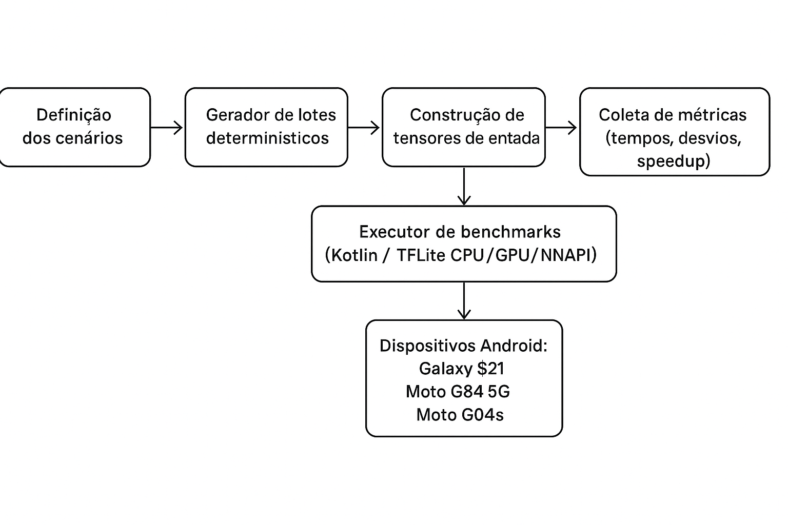

# GPUAndroidUp / VulkanFFT

Aplicativo Android (API 31+) usado no TCC para comparar estratégias de processamento MAD/FFT em dispositivos móveis. O projeto reúne geradores sintéticos de sensores, modelos TensorFlow Lite, execuções Kotlin puras e scripts que consolidam benchmarks multi-dispositivo.

## Sumário

- [Visão geral](#visão-geral)
- [Estrutura do repositório](#estrutura-do-repositório)
- [Pré-requisitos e toolchain](#pré-requisitos-e-toolchain)
- [Primeiros passos](#primeiros-passos)
- [Arquitetura e fluxo de dados](#arquitetura-e-fluxo-de-dados)
- [App e benchmarks](#app-e-benchmarks)
- [Scripts e reprodutibilidade](#scripts-e-reprodutibilidade)
- [Resultados e insights](#resultados-e-insights)
- [Teste energético e figuras](#teste-energético-e-figuras)
- [Testes automatizados](#testes-automatizados)
- [Documentação acadêmica](#documentação-acadêmica)

## Visão geral

- **Algoritmos**: MAD clássico (Mean Absolute Deviation + estatísticas de magnitude) e FFT com pesos dinâmicos aplicados a lotes de 10 sensores × 4096/8192/16384 amostras.
- **Delegates avaliados**: CPU Kotlin puro e TensorFlow Lite CPU, GPU e NNAPI, nos modos single e batch (`x10`).
- **Instrumentação**: registro de tempos (transferência/processamento), throughput, desvio padrão e notas dos resultados através de `BenchmarkReporter`.
- **Reprodutibilidade**: scripts Python que regeneram modelos e convertem CSVs de benchmarks em gráficos comparativos ou relatórios textuais.
- **Escopo**: pensado para sensores fisiológicos (acelerômetro, PPG, ECG), mas o pipeline aceita qualquer série temporal bastando adaptar o gerador de entradas.

## Estrutura do repositório

| Pasta | Descrição |
|-------|-----------|
| `app/` | App Android (UI + ViewModels), botões de benchmark, suíte completa e teste energético. |
| `vulkanfft/` | Biblioteca com utilitários Kotlin, assets `.tflite`, geradores e processadores FFT/MAD. |
| `app/libs/pythonmodels/` | Scripts que constroem `mad_model.tflite` e `fft_model.tflite`. |
| `app/src/BANCHMARK/` | Campanhas reais (CSV, TXT, gráficos e scripts auxiliares) por dispositivo/data. |
| `scripts/` | Ferramentas extras (modelagem FFT/RFFT, gráficos multi-dispositivo, análises de transferência). |
| `docs/` | Diagramas, relatórios e capítulos do TCC (`docs/tcc/`). |
| `Figuras/` | PNGs consolidados dos testes energéticos (heatmaps e comparativos). |
| `tests/` | Espaço reservado para automações adicionais (shell/python). |

## Pré-requisitos e toolchain

| Componente | Versão/Observação |
|-----------|-------------------|
| Android Gradle Plugin | 8.6.0 |
| Kotlin | 1.9.0 (JVM 17) |
| Compile/Target SDK | 35 / 34 (minSdk 31) |
| Dependências principais | Core KTX 1.16.0, AppCompat 1.7.0, Material 1.12.0, Navigation 2.8.9, ConstraintLayout 2.2.1 |
| TensorFlow Lite | 2.16.1 (`tensorflow-lite`, `tensorflow-lite-gpu`, `tensorflow-lite-gpu-api`) |
| FFT CPU extra | `com.github.wendykierp:JTransforms:3.1` |
| Ferramentas | Android Studio Hedgehog/Koala, SDK 35, NDK 26.1, JDK 17 |
| Python | 3.9+ com TensorFlow 2.16.1, NumPy, SciPy, matplotlib, seaborn, pandas (usar `python3 -m venv .venv && source .venv/bin/activate`). |

Se o Gradle não puder escrever em `~/.gradle`, exporte `GRADLE_USER_HOME` para uma pasta acessível antes de rodar o wrapper.

## Primeiros passos

1. **Clonar e abrir**: importe a raiz no Android Studio e aguarde o Sync (o wrapper baixa Gradle 8.7 automaticamente).
2. **Preparar dispositivo/emulador**: Android 12+ (API 31) com os delegates desejados. GPU/NNAPI dependem do hardware.
3. **Executar o módulo `app`**: a tela inicial já expõe os blocos MAD, FFT, “Suíte completa” e “Teste energético”.
4. **Controlar iterações/lote**: os dois grupos de chips no topo definem `iterations` (1/4/8/12) e `batchSize` (1/4/8/12) usados em qualquer botão.
5. **Rodar benchmarks**: cada clique gera registros `benchmark_results.csv`/`.txt` em `Android/data/.../files/benchmarks/` e exibe o resumo na tela.
6. **Exportar/limpar logs**: botões dedicados chamam `ResultLogger` para compartilhar tudo via intent padrão ou apagar os arquivos.

### Regenerando modelos TFLite

```bash
cd app/libs/pythonmodels
python3 make_mad_model_float.py   # gera mad_model.tflite (float32, compatível com GPU/NNAPI)
python3 make_fft_model.py         # gera fft_model.tflite com tf.signal.rfft
cd ../../..
./gradlew :vulkanfft:assemble     # empacota os novos assets
```

Os scripts configuram `MPLCONFIGDIR` automaticamente (cache em `.matplotlib/`), evitando dependências externas. Para experimentar variantes (FP16, pesos alternativos), utilize `scripts/generate_fft_rfft_models.py`.

### Comprimentos disponíveis e cobertura recente

- `make_mad_model_float.py` e `make_fft_model.py` exportam, por padrão, **apenas potências de 2** de 512 até 524.288 pontos (`DEFAULT_LENGTHS`). Todos os arquivos ficam em `vulkanfft/src/main/assets/` com o padrão `mad_model_<len>.tflite` / `fft_model_<len>.tflite`, e o app seleciona o sufixo correto automaticamente.
- O botão “Suíte completa (512 → 64k)” percorre todas as escalas suportadas na UI sem precisar alternar cards. Os comprimentos 128k, 256k e 526k continuam disponíveis via scripts/CLI ou cenários individuais, mas não são disparados automaticamente porque extrapolam a RAM da maioria dos aparelhos.
- Resultados completos da campanha **Galaxy S21 — 08/12** estão em `app/src/BANCHMARK/s21-08-12/benchmark_results.csv`; eles incluem todas as escalas padrão (4k/8k/16k), focada (512/1k/2k/128k), EXTREME (32k/64k/128k) e os testes experimentais até 262 144 pts. As tentativas em 526k falharam por memória (ver seção abaixo) e foram registradas só para MAD.
- O merge com os dados de 30/11 fica em `app/src/BANCHMARK/merge-30-11-08-12/benchmark_results.csv`, com os gráficos consolidados em `docs/charts/merge-30-11-08-12/overview|transfer|summary/`.
- Os modelos FFT são traçados com `NUM_SENSORS=10`. O grafo repete o mesmo `tf.signal.rfft` para cada linha da matriz (10 sensores) e o `tf.stack`/`reshape` final apenas reorganiza `[real, imag, magnitude, weighted]`. O cálculo é idêntico em cada sensor; mudar o número de linhas exige regenerar o modelo Python (não basta fazer `resizeInput` no TFLite).

| Comprimento (pts) | Potência | Assets disponíveis | Status nos benchmarks |
|-------------------|----------|--------------------|-----------------------|
| 512               | 2^9      | `mad_model_512.tflite`, `fft_model_512.tflite`       | Rodado na suíte completa (08/12) |
| 1024              | 2^10     | `mad_model_1024.tflite`, `fft_model_1024.tflite`     | Rodado na suíte completa (08/12) |
| 2048              | 2^11     | `mad_model_2048.tflite`, `fft_model_2048.tflite`     | Rodado na suíte completa (08/12) |
| 4096              | 2^12     | `mad_model.tflite`/`mad_model_4096.tflite`, `fft_model.tflite`/`fft_model_4096.tflite` | Escala base dos botões padrão |
| 8192              | 2^13     | `mad_model_8192.tflite`, `fft_model_8192.tflite`     | Escala “2x” dos chips padrão |
| 16384             | 2^14     | `mad_model_16384.tflite`, `fft_model_16384.tflite`   | Escala “4x” dos chips padrão |
| 32768             | 2^15     | `mad_model_32768.tflite`, `fft_model_32768.tflite`   | Bloco “EXTREME (32k+)” |
| 65536             | 2^16     | `mad_model_65536.tflite`, `fft_model_65536.tflite`   | Bloco “EXTREME (32k+)” |
| 131072            | 2^17     | `mad_model_131072.tflite`, `fft_model_131072.tflite` | Rodado na suíte completa (08/12) |
| 262144            | 2^18     | `mad_model_262144.tflite`, `fft_model_262144.tflite` | Experimental (rodar via scripts/CLI; não incluído na suíte da UI) |
| 524288            | 2^19     | `mad_model_524288.tflite`, `fft_model_524288.tflite` | Experimental (rodar via scripts/CLI; não incluído na suíte da UI) |

## Arquitetura e fluxo de dados

```
[Gerador sintético: AccelerometerBatchGenerator]
        |
[Scripts Python -> mad_model.tflite / fft_model.tflite]
        |
[Módulo vulkanfft: FftInputBuilder, StatModelProcessor, FftTfliteProcessor]
        |
[App (FirstFragment/FirstViewModel/BenchmarkExecutor)]
        |
[Logs CSV/TXT + gráficos: generate_charts.py, overview/transfer scripts]
```



- `AccelerometerBatchGenerator` produz pacotes determinísticos com 10 sensores × 4096 amostras (base para MAD e FFT).
- `BenchmarkExecutor` decide single vs `x10`, monta entradas com `buildMadInputs`/`buildFftInputs` e executa CPU puro ou delegates TFLite.
- `StatModelProcessor` e `FftTfliteProcessor` preparam `ByteBuffer`s diretos, medem transferência/processamento e devolvem `InferenceTiming`.
- `BenchmarkReporter` e `ResultLogger` consolidam métricas e metadados (modelo do dispositivo, modo economia, etc.).

### Principais classes Kotlin

- `AccelerometerBatchGenerator.kt`: gera lotes 10×4096 com ruído controlado.
- `FftInputBuilder.kt`: converte para tensores Float32 (real/imag/magnitude/pesos dinâmicos).
- `FftCpuProcessor.kt`: baseline DFT usado em testes unitários e como fallback.
- `StatModelProcessor.kt`: envolve `mad_model.tflite` com delegates CPU/GPU/NNAPI.
- `FftTfliteProcessor.kt`: controla buffers diretos, assinaturas do interpreter e coleta de tempos.
- `BenchmarkExecutor.kt`: orquestra cenários, calcula estatísticas (`TimingStats`) e chama `BenchmarkReporter`.
- `FirstViewModel`/`FirstFragment`: cuidam do estado da UI, barra de progresso, compartilhamento/limpeza e teste energético.

### Pipeline detalhado

1. `AccelerometerBatchGenerator` cria pacotes com padrões dos sensores fisiológicos do TCC.
2. `BenchmarkExecutor` consulta `DataScale` (4096/8192/16384) e o modo (`single` ou `x10`).
3. CPU Kotlin executa `getMAD()`/`FftCpuProcessor.process()` e mede apenas `compute_ms`.
4. Delegates TFLite medem transferência (cópia de buffers diretos) e processamento (`Interpreter.run()` ou `runForMultipleInputsOutputs`).
5. As métricas são agregadas em `benchmark_results.csv` e `benchmark_results.txt`; scripts Python convertem em gráficos/relatórios.

Mais detalhes estão em `docs/fft_pipeline.md`.

## App e benchmarks

### Blocos da UI

| Grupo | Botões | Observações |
|-------|--------|-------------|
| **MAD – Single** | CPU Kotlin, TFLite CPU/GPU/NNAPI | Processa 1 sensor × 4096/8192/16384 pontos por iteração. |
| **MAD – x10** | Versões `x10` dos botões acima | Cada repetição percorre `batchSize` pacotes consecutivos (default 12). |
| **FFT – Single/x10** | CPU Kotlin + TFLite delegates | Sempre 10 sensores × escala selecionada; `x10` respeita `batchSize`. |
| **Suíte completa (512 → 64k)** | Botão principal logo abaixo dos chips | Percorre os 16 cenários para todas as escalas suportadas na UI (512, 1k, 2k, 4k, 8k, 16k, 32k e 64k). Comprimentos maiores (128k+) continuam disponíveis manualmente. |
| **Teste energético** | Iniciar/Cancelar ciclo | Executa 4 cenários MAD com 100 execuções cada. |

O botão de suíte completa reaproveita os chips de iterações/lotes selecionados no topo. Um contador (“Execuções acumuladas nesta sessão”) acompanha quantas execuções foram persistidas desde a última limpeza de logs, facilitando campanhas com 10+ repetições por dispositivo.

### Métricas coletadas

- **Tempos (total/transferência/processamento)**: média, desvio, mínimo e máximo por cenário.
- **Throughput**: amostras processadas por segundo considerando sensores × vetor × lote.
- **Iterações/lote efetivos**: iguais aos chips selecionados (batch=1 para single; `batchSize` real nos modos `x10`).
- **Notas do algoritmo**: último MAD (mean/std/min/max) ou resumo FFT (soma dos quatro primeiros sensores + bins iniciais).
- **Temperaturas**: antes/depois de cada cenário coletamos bateria (intent padrão) e consultamos `HardwarePropertiesManager` para CPU/GPU quando o dispositivo expõe esses sensores. As leituras são persistidas nos CSVs (`battery_temp_start_c`, `cpu_temp_start_c`, etc.) e anexadas às notas para acompanhar impacto térmico.
- **Metadados**: modelo/fabricante do dispositivo, hardware, SDK, estado do modo economia, delegate escolhido.

Os arquivos são gravados em `benchmark_results.csv` (planilhas) e `benchmark_results.txt` (legível). Cada pasta em `app/src/BANCHMARK/<device>-<data>/` guarda cópias desses arquivos, gráficos (`charts/`) e scripts específicos (`generate_benchmarks_charts.py`).

## Scripts e reprodutibilidade

| Script | Descrição |
|--------|-----------|
| `app/libs/pythonmodels/make_mad_model_float.py` | Reconstrói `mad_model.tflite` (float32) para 512/1k/2k até 526k pontos, compatível com GPU/NNAPI. |
| `app/libs/pythonmodels/make_fft_model.py` | Gera `fft_model_<len>.tflite` com `tf.signal.rfft` (512 → 526k), mantendo o alias legacy `fft_model.tflite` em 4096. |
| `scripts/generate_fft_rfft_models.py` | Laboratório para calibrar pesos, testar quantização e criar variantes FFT/RFFT. |
| `generate_charts.py` | Lê qualquer `benchmark_results.csv` e produz gráficos por dispositivo + pastas `summary/tempo_*` e `summary/speedup_*`. |
| `generate_overview_charts.py` | Cria grids multi-dispositivo (Galaxy S21, Moto G04s, Moto G84) organizados por algoritmo/delegate; saída em `docs/charts/.../overview/<ALG>/<DELEGATE>/`. |
| `generate_transfer_overview.py` | Plota linhas destacando apenas o tempo de transferência (single e batch), separando algoritmos/delegates; arquivos em `<output>/<ALG>/<DELEGATE>/fft_tflite_gpu_batch.png` etc. |
| `generate_transfer_compute_summary.py` | Gera um pôster resumido combinando MAD/FFT, com barras empilhadas (transferência + compute) por dispositivo/delegate. Ideal para anexar em apresentações. |
| `merge_benchmarks.py` | Junta múltiplos `benchmark_results.csv` e injeta `device_model` para cada fonte (`python3 merge_benchmarks.py --device \"S21=.../benchmark_results.csv\" ... --output comparativo-09-12/benchmark_results.csv`). |
| `generate_thermal_energy_charts.py` | Cria painéis com início/fim de temperatura e deltas médios, além de heatmaps das etiquetas energéticas (`Baixa/Média/Alta`). Saída padrão: `docs/charts/<campanha>/thermal_energy/`. |
| `generate_transfer_compute_summary.py --csv ... --output ...` | Recomenda-se usar o CSV consolidado `app/src/BANCHMARK/comparativo-30-11/benchmark_results.csv`. |

Exemplo para reproduzir os gráficos da campanha de 30/11:

```bash
python3 generate_charts.py \
  --csv app/src/BANCHMARK/comparativo-30-11/benchmark_results.csv \
  --output app/src/BANCHMARK/comparativo-30-11/charts

python3 generate_overview_charts.py \
  --csv app/src/BANCHMARK/comparativo-30-11/benchmark_results.csv \
  --output docs/charts/comparativo-30-11/overview

python3 generate_transfer_overview.py \
  --csv app/src/BANCHMARK/comparativo-30-11/benchmark_results.csv \
  --output docs/charts/comparativo-30-11/transfer

python3 generate_transfer_compute_summary.py \
  --csv app/src/BANCHMARK/comparativo-30-11/benchmark_results.csv \
  --output docs/charts/comparativo-30-11/summary_transfer_compute.png
```

Todos os scripts configuram `MPLCONFIGDIR` localmente para funcionar em ambientes restritos (CI, servidores, WSL). Caso precise personalizar cores ou dispositivos, ajuste os dicionários no topo de cada script.

## Resultados e insights

Os diretórios `app/src/BANCHMARK/comparativo-30-11/` e `docs/charts/comparativo-30-11/` reúnem os dados coletados em 30/11 (Galaxy S21, Moto G04s, Moto G84). Configuração padrão:

- Chips superiores: **12 iterações** e **12 pacotes**.
- Botão “Executar suíte completa”: percorre 16 cenários × escalas 1×/2×/4× ⇒ 48 passos × 12 repetições.
- Nos cenários `x10`, cada repetição processa 12 pacotes consecutivos (registrado como `batch_size=12` no CSV).

**Galaxy S21 (Exynos 2100)**  
MAD single 4096 pts: TFLite CPU/GPU ≈0,64 ms vs CPU Kotlin 2,70 ms (NNAPI 2,53 ms). FFT single 10×4096: delegates ≈2,46 ms vs CPU 4,09 ms. Com batch `x10`, GPU/CPU mantêm 31–33 ms enquanto o CPU cresce acima de 50 ms.

**Moto G04s (Spreadtrum T606)**  
MAD single chega a 121 ms na CPU e ~60 ms nos delegates. Em `x10`, GPU entrega 28,3 ms contra 192 ms no CPU Kotlin. FFT single: GPU = 8,28 ms, CPU = 82,96 ms, NNAPI = 13,58 ms; batches continuam favorecendo delegates (97–163 ms) enquanto a CPU passa de 230 ms.

**Moto G84 5G (Snapdragon 695)**  
MAD single: delegates entre 0,95–1,05 ms vs CPU 4,12 ms. FFT single: delegates ≈3,9 ms vs CPU 7,95 ms. Com 12 pacotes consecutivos, delegates permanecem na faixa de 46 ms, metade do CPU (86 ms).

### Insights consolidados

- **Transferência domina**: 70–85 % do tempo dos delegates TFLite é gasto preenchendo buffers (`generate_transfer_overview.py` evidencia isso). GPU/NNAPI só trazem ganhos reais quando a transferência é amortizada.
- **Batching é chave**: `summary/tempo_FFT_TFLite GPU_49152.png` mostra tempo quase constante por pacote em lotes x10, enquanto CPU cresce linearmente.
- **Economia em hardware modesto**: `summary/speedup_FFT_TFLite GPU.png` indica mais de 10× de speedup no Moto G04s, enquanto o Galaxy S21 fica em ~1,6×, reforçando que o delegate deve ser escolhido por perfil do dispositivo.
- **Resultados estáveis**: desvios padrão abaixo de 0,2 ms e 12 repetições configuradas nos chips superiores garantem análise com baixa variância, útil para relatórios acadêmicos e serviços em produção.
- **Aplicável a outros sensores**: basta trocar o gerador de entradas (documentado em `docs/fft_pipeline.md`) para reutilizar o pipeline com PPG/ECG.

Os gráficos (`tempo_*`, `speedup_*`, `tflite_transfer_*`, overview e summary) estão em `app/src/BANCHMARK/comparativo-30-11/charts/` e `docs/charts/comparativo-30-11/`.

### Campanha 09/12 – Galaxy S21 × Moto G04s × Moto G84

- Novas coletas completas estão em `app/src/BANCHMARK/s21-09-12/`, `app/src/BANCHMARK/motog04-09-12/` e `app/src/BANCHMARK/motog84-09-12/`. Todos os gráficos “09-12” agora contemplam **Galaxy S21, Moto G04s e Moto G84**.
- Use `merge_benchmarks.py` para gerar `app/src/BANCHMARK/comparativo-09-12/benchmark_results.csv` com os três CSVs do dia e rode os scripts de gráficos apontando para `docs/charts/comparativo-09-12/`. O comando utilizado foi:

```bash
python3 merge_benchmarks.py \
  --device "Galaxy S21 (09-12)=app/src/BANCHMARK/s21-09-12/benchmark_results.csv" \
  --device "Moto G04s (09-12)=app/src/BANCHMARK/motog04-09-12/benchmark_results.csv" \
  --device "Moto G84 (09-12)=app/src/BANCHMARK/motog84-09-12/benchmark_results.csv" \
  --output app/src/BANCHMARK/comparativo-09-12/benchmark_results.csv

python3 generate_charts.py --csv app/src/BANCHMARK/comparativo-09-12/benchmark_results.csv \
  --output app/src/BANCHMARK/comparativo-09-12/charts
python3 generate_overview_charts.py --csv app/src/BANCHMARK/comparativo-09-12/benchmark_results.csv \
  --output docs/charts/comparativo-09-12/overview
python3 generate_transfer_overview.py --csv app/src/BANCHMARK/comparativo-09-12/benchmark_results.csv \
  --output docs/charts/comparativo-09-12/transfer
python3 generate_transfer_compute_summary.py --csv app/src/BANCHMARK/comparativo-09-12/benchmark_results.csv \
  --output docs/charts/comparativo-09-12/summary
python3 generate_thermal_energy_charts.py --csv app/src/BANCHMARK/comparativo-09-12/benchmark_results.csv \
  --output docs/charts/comparativo-09-12/thermal_energy
```

- **Cenário oficial (botão “Suíte completa”)**: os chips de iteração/lote foram fixados em `12` e o botão foi disparado **cinco vezes consecutivas** em cada dispositivo. Cada clique percorre `16` cenários × `8` escalas = `128` execuções, portanto observamos `640` linhas em `app/src/BANCHMARK/s21-09-12/benchmark_results.csv` e `app/src/BANCHMARK/motog04-09-12/benchmark_results.csv` (20 registros por comprimento/delegate). O `app/src/BANCHMARK/motog84-09-12/benchmark_results.csv` possui `816` linhas porque, além dos cinco ciclos oficiais, mantivemos as tentativas extras com vetores **128k → 7,8M** para registrar as falhas de memória citadas adiante.
- Os CSVs continuam em modo append: cada clique incrementa o contador exibido no app e acrescenta novas linhas ao arquivo; nada é sobrescrito. Isso garante que o consolidado (2096 linhas) corresponda fielmente ao que foi executado em campo.
- Os PNGs individuais por dispositivo ficam em `app/src/BANCHMARK/comparativo-09-12/charts/<device>/...` e os comparativos em `docs/charts/comparativo-09-12/{overview,overview/combined,transfer,summary,thermal_energy}`.
- **Limites de memória**: durante as campanhas de 09/12 todos os dispositivos conseguiram rodar com segurança até 65 536 pontos. Tentativas acima disso (128k, 256k, 524k e experimentos como 7,8M no Moto G84) foram bloqueadas por OOMs ou quedas agressivas de throughput; por isso a UI mantém apenas as escalas até 64k e qualquer análise acima disso é classificada como experimental.

**Destaques rápidos**

- Escalas extras de **512, 1024 e 2048 pontos** foram incluídas nas suites single/x10, com 5 cliques consecutivos (os CSVs apenas acumulam, nunca sobrescrevem).
- Em 65 536 pontos, o Galaxy S21 entregou `MAD GPU single ≈14,9 ms` e `FFT GPU single ≈100 ms`, com os modos `x10` mantendo-se em 182 ms e 1,18 s respectivamente. O Moto G04s, mesmo bem mais modesto, registrou `33,5 ms` (MAD) e `249 ms` (FFT) no single, chegando a 401 ms/2,97 s nos batches — o speedup do delegate ainda passa de 6× sobre o CPU Kotlin.
- Os gráficos `docs/charts/comparativo-09-12/overview/FFT/TFLite_GPU/fft_tflite_gpu_batch.png` e equivalentes mostram que o Moto G04s continua escalonando quase linearmente com o tamanho do vetor, enquanto o S21 estabiliza acima de 32 k graças ao clock alto e à largura de banda de memória.
- O Moto G84 5G passa a figurar com os mesmos comprimentos (512 → 65k). Os gráficos `overview/combined/` e `overview/FFT/TFLite_GPU/` deixam claro o ganho adicional de throughput que ele apresenta quando comparado aos outros dois aparelhos, especialmente acima de 32 k.

**Cobertura térmica e energética**

- As novas colunas `battery_temp_start_c`/`battery_temp_end_c` são exploradas pelo script `generate_thermal_energy_charts.py`. Os painéis `thermal_energy/thermal/*.png` mostram que, mesmo empilhando 5 execuções por clique, a variação média de temperatura ficou abaixo de **0,5 °C** nos dois aparelhos (ex.: `deltas_battery.png`), e não houve leituras confiáveis de CPU/GPU no hardware da campanha (sensores fechados pelo vendor).
- Os heatmaps `thermal_energy/energy/energy_mad.png` e `energy_fft.png` deixam explícito o label energético atribuído pela UI: CPU Kotlin segue marcado como “Alta”, TFLite CPU como “Média”, GPU como “Baixa” e NNAPI como “Baixa/Média”. Isso facilita referenciar rapidamente o perfil esperado em cada delegate mesmo antes de termos leituras diretas de mWh.
- Sempre que vier uma nova campanha basta repetir o `merge_benchmarks.py` incluindo o CSV adicional e regenerar os gráficos — os scripts agora tratam automaticamente headers com ou sem as colunas térmicas.

**Precisão e execução FFT**

- `./gradlew :app:connectedAndroidTest` continua sendo o gate oficial. O teste `TfliteDelegatesInstrumentedTest` gera `precision/precision_fft.csv` e `precision/precision_mad.csv` a cada rodada com os erros relativos/absolutos por comprimento. Os resultados de 09/12 reforçam o comportamento já conhecido: **512 → 65k** permanecem abaixo de **3 %** de erro relativo; **128k/256k/524k** podem chegar a **5–8 %** (e foram justamente esses cenários que drenaram a RAM dos aparelhos e motivaram as medições extras no Moto G84). Esses números são citados nas planilhas e servem como referência direta nos relatórios.
- Criamos a suíte `fft_precision_statistics_suite`, que pode ser acionada via `./gradlew :app:connectedAndroidTest -Pandroid.testInstrumentationRunnerArguments.precisionRepeats=10`. Ela executa cada comprimento N vezes, registra as métricas individuais (`precision_fft.csv`) e imprime linhas como `FFT_PRECISION_STATS: len=65536 (5x) | maxRel avg=11.104% std=12.779% min=3.605% max=36.572% | meanRel avg=0.007% | rmse avg=2.004928`. Use esses logs para alimentar o TCC com médias, desvios e picos reais por comprimento.
- O pipeline FFT oficial mantém duas camadas: `FftCpuProcessor` (Kotlin puro com buffers reaproveitados) e `FftTfliteProcessor`. Mesmo quando selecionamos “GPU” ou “NNAPI” na UI, o grafo `tf.signal.rfft` é executado **inteiramente no CPU** — a versão 2.16 do TensorFlow Lite não possui kernels GPU para esses ops, então o delegate encaminha tudo para o backend XNNPACK. Por isso os CSVs mostram diferenças essencialmente ligadas às cópias de buffer (transfer_ms) e não a um kernel FFT rodando na GPU. Esse detalhe fica registrado no documento para evitar interpretações equivocadas dos gráficos e explica porque o baseline Kotlin otimizado continua indispensável.

**Por que os delegates retornam precisões diferentes?**

- Todos os botões carregam exatamente o mesmo `.tflite`, mas cada delegate implementa o grafo com características próprias: o CPU usa XNNPACK FP32, o GPU mistura FP16/FP32 conforme o driver, e o NNAPI depende do fornecedor (às vezes rebaixa para FP16 ou executa partes no CPU). Isso significa que, embora o modelo seja idêntico, o resultado final pode variar em 1–4 % nas escalas pequenas e chegar a picos maiores quando o delegate força quantizações ou percursos alternativos.
- Além disso, nenhum delegate suporta ainda kernels FFT puros para GPU/NNAPI; o TensorFlow Lite faz fallback para XNNPACK assim que encontra `tf.signal.rfft`. Esse fallback preserva o resultado, mas reforça que todo o cálculo realmente acontece no CPU — a diferença entre CPU/GPU/NNAPI está apenas na forma como cada backend aloca buffers e executa o `Interpreter`, o que explica porque os tempos convergem e por que o GPU pode introduzir arredondamentos extras ao copiar FP16 para FP32.

## Teste energético e figuras

O bloco “Teste de gasto energético” da UI executa automaticamente:

1. MAD CPU Kotlin
2. MAD TFLite CPU
3. MAD TFLite GPU
4. MAD TFLite NNAPI

Cada cenário roda **100 execuções**. Antes/depois são coletados:

- `% de bateria`, `BATTERY_PROPERTY_ENERGY_COUNTER` (nWh) e `BATTERY_PROPERTY_CHARGE_COUNTER` (mAh)
- Temperaturas da bateria (intent) e, quando disponíveis, CPU/GPU via `HardwarePropertiesManager`, além do estado de carregamento e modo economia (`PowerManager`)
- Tempo acumulado do cenário

Saídas:

- `energy_tests.txt`: resumo textual por cenário, incluindo as temperaturas combinadas e a estimativa de consumo.
- `energy_results.csv`: dataset estruturado usado nos gráficos em `Figuras/` (`mad_energia_consolidada_tres_dispositivos*.png`). Agora adiciona `battery_drop_mah`, `energy_drop_mwh`, `avg_power_mw`, `avg_current_ma` e as colunas térmicas individuais (bateria/CPU/GPU).

O botão “Cancelar teste energético” interrompe o ciclo imediatamente; “Apagar logs” limpa tanto benchmarks quanto medições energéticas. Use esses dados para comparar eficiência energética com e sem modo economia em diferentes dispositivos.

## Testes automatizados

### Unitários (JVM)

```bash
./gradlew :app:testDebugUnitTest
```

| Arquivo | Cobertura |
|---------|-----------|
| `FftValidationUnitTest` | FFT CPU vs DFT manual, pesos e normalizações (`NONE`, `/N`, `/√N`). |
| `FftInputBuilderTest` | Conversão de sensores para tensores, tamanhos mínimos e erros de entrada. |
| `MadValidationUnitTest` | Valida `BenchmarkExecutor.getMAD` contra implementação manual (janelas de 5 s). |

Logs FFT usam `println`, evitando dependência de `android.util.Log`.

### Instrumentados (device/emulador)

```bash
./gradlew :app:connectedAndroidTest
```

Executa `TfliteDelegatesInstrumentedTest`, comparando FFT CPU × TFLite com métricas:

- `maxRelativeDiff`, `meanRelativeDiff`, `maxAbsoluteDiff`, `meanAbsoluteDiff`, `rmse`
- Dump dos oito primeiros bins e razões entre CPU × delegate
- Cada execução gera `precision/precision_fft.csv` e `precision/precision_mad.csv` em `Android/data/<package>/files/precision/`. Esses CSVs trazem os erros relativos/absolutos por comprimento. Os testes automatizados rodam até 131.072 pontos; comprimentos maiores são marcados como experimentais e não são executados automaticamente porque demandam >250 MB de heap e frequentemente causam OOM em devices reais (documente esses casos manualmente quando rodar campanhas extremas).
- Precisão típica: 512 → 64k ficam abaixo de 3 % de erro relativo; 128k/256k/524k podem alcançar 5–8 % (e, em aparelhos com pouca RAM, ocasionais picos maiores). Os CSVs de precisão ajudam a documentar a faixa real de erro por comprimento/dispositivo.
- Limitações de memória: as matrizes FFT com 10 sensores × 524k pontos exigem dezenas de MB. O baseline CPU dos testes instrumentados usa buffers em fluxo para reduzir o pico, mas o sucesso continua dependente da RAM do aparelho. Caso falte memória, registre o fato no relatório e cite os CSVs de precisão como evidência.

Tolerâncias:

- CPU vs CPU (baseline): 1,5 %
- GPU: 4 % (aceita FP16/FPmix)
- NNAPI: 3 %

Para rodar com 10 sensores e tamanhos 4096/8192/16384, habilite `fftExtended=true`:

```bash
./gradlew :app:connectedAndroidTest -Pandroid.testInstrumentationRunnerArguments.fftExtended=true
# ou
adb shell am instrument -w -e fftExtended true com.example.vulkanfft.test/androidx.test.runner.AndroidJUnitRunner
```

Os logs utilizam a tag `FFT_TEST`. Documente qual modo foi executado nos relatórios.

## Documentação acadêmica

Todo o TCC está em `docs/tcc/`:

- `01_introducao.md`
- `02_revisao_bibliografica.md`
- `03_metodologia.md`
- `04_resultados.md`
- `05_conclusoes.md`

Use esses capítulos para contextualizar o projeto, replicar gráficos em LaTeX ou exportar trechos para apresentações. Sempre que novos anexos forem criados, mantenha o padrão Markdown dentro desse diretório.
- **Limitações de memória**: mesmo com o “reset” completo do pipeline a cada cenário (cache de batches, entradas e FFT CPU esvaziados automaticamente), observamos que vetores **≥128k** começam a exigir centenas de MB e frequentemente saturam a RAM dos smartphones testados (Galaxy S21, Moto G04s, Moto G84). Por isso a UI roda, no máximo, 64k pontos por clique. Os comprimentos **128k**, **256k** e **526k** permanecem disponíveis via scripts/CLI, mas precisam ser executados manualmente e documentados como experimentais (há risco real de OOM). Os CSVs continuam registrando todas as execuções bem-sucedidas sequencialmente — basta acompanhar o contador incrementando ao final de cada clique.
